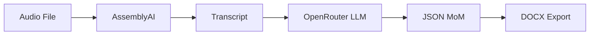

# 📝 Minutes of Meeting Generator


A powerful Streamlit-based prototype that converts audio meeting recordings into structured Minutes of Meeting (MoM) documents using AI.

## ✨ Features

- 🎵 **Audio Upload**: Support for MP3, WAV, M4A, MP4 files
- 📝 **AI Transcription**: Powered by AssemblyAI (free tier)
- 🤖 **Smart MoM Generation**: Using OpenRouter + DeepSeek model
- 📄 **Professional Export**: Generate formatted DOCX documents
- 🌐 **Clean Interface**: Intuitive Streamlit web app
- ⚡ **Free Tier**: Uses free APIs for cost-effective solution

## 🚀 Quick Start

```bash
# Clone the repository
git clone https://github.com/diplom264-bit/Minutes_of_meeting_gen.git
cd Minutes_of_meeting_gen

# Install dependencies
pip install -r requirements.txt

# Set up environment variables
cp .env.example .env
# Edit .env with your API keys

# Run the application
streamlit run app.py
```

## 🔑 API Setup

### AssemblyAI (Free Tier)
1. Sign up at [AssemblyAI](https://www.assemblyai.com/)
2. Get your API key from the dashboard
3. Add to `.env`: `ASSEMBLYAI_API_KEY=your_key`

### OpenRouter (Free Tier)
1. Sign up at [OpenRouter](https://openrouter.ai/)
2. Get your API key from the dashboard  
3. Add to `.env`: `OPENROUTER_API_KEY=your_key`

## 📱 How to Use

1. **Launch**: Open `http://localhost:8501` in your browser
2. **Upload**: Select your meeting audio file
3. **Process**: Click "Generate Minutes of Meeting"
4. **Review**: View transcript and structured MoM
5. **Download**: Get your professional DOCX document

## 🏗️ Architecture



## 📁 Project Structure

```
├── app.py              # Streamlit frontend
├── transcribe.py       # AssemblyAI integration
├── llm.py             # OpenRouter LLM processing
├── docx_utils.py      # DOCX generation
├── requirements.txt   # Python dependencies
├── .env.example       # Environment template
├── SETUP.md           # Quick setup guide
└── ARCHITECTURE.md    # Technical documentation
```

## 📊 Output Format

Generated MoM includes:
- 📋 **Meeting Details**: Title, date, attendees
- 🎯 **Agenda Items**: Structured discussion topics
- 💡 **Key Points**: Important discussion highlights
- ✅ **Action Items**: Tasks with owners and due dates
- 🎯 **Decisions Made**: Clear decision documentation
- ➡️ **Next Steps**: Follow-up actions

## 🛠️ Tech Stack

- **Frontend**: Streamlit
- **Transcription**: AssemblyAI API
- **AI Processing**: OpenRouter + DeepSeek
- **Document Generation**: python-docx
- **Environment**: Python 3.8+

## 📄 License

MIT License - see [LICENSE](LICENSE) file for details.

## 🤝 Contributing

1. Fork the repository
2. Create feature branch (`git checkout -b feature/amazing-feature`)
3. Commit changes (`git commit -m 'Add amazing feature'`)
4. Push to branch (`git push origin feature/amazing-feature`)
5. Open a Pull Request

## 📞 Support

For issues and questions:
- 🐛 [Report bugs](https://github.com/diplom264-bit/Minutes_of_meeting_gen/issues)
- 💡 [Request features](https://github.com/diplom264-bit/Minutes_of_meeting_gen/issues)
- 📖 [Read documentation](SETUP.md)

---

⭐ **Star this repo if you find it helpful!**